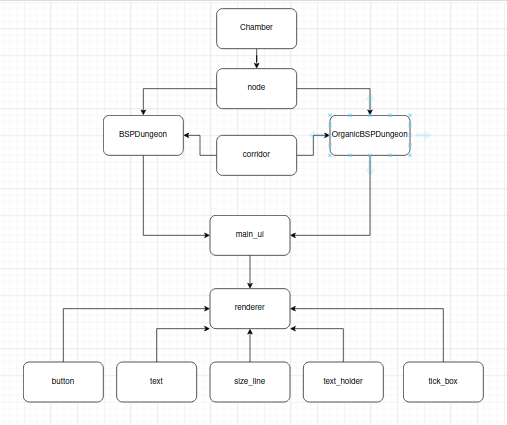

# Implementation document

This document explains specifics about the project structure and implementation methods used in the project.
 
## Project Structure

The program follows the idea of seperation of concerns and simplicity while still retaining a design that is intuitive to a human. 

The main program is split into four main classes, a ui_service class and a function for visualization. The main  program is divided into two parts depending on wether the user wants to generate a more sterile sewer-like dungeon or a more organic limestone-cave-like dungeon. Depending on this decision the program will use either the normal BSPDungeon or OrganicBSPDungeon class. Both of these are structured in a similar way and differs mostly at the stage where chambers/rooms are to be connected. They both make use of the Node class and Chamber class. The Node class is the core of the BSP algorithm as it is used to create and store the binary tree through the Binary space partiitoning algorithm (BSP). The chamber class holds information about chamber dimensions and locations. When the random dungeon has been generated it is exported to the draw_dungeon function which visualizes the dungeon through the pygame module.   

Here is a visualization of the project structure:

