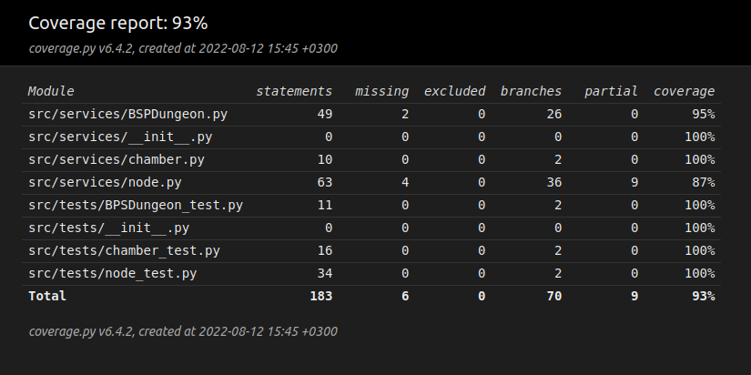
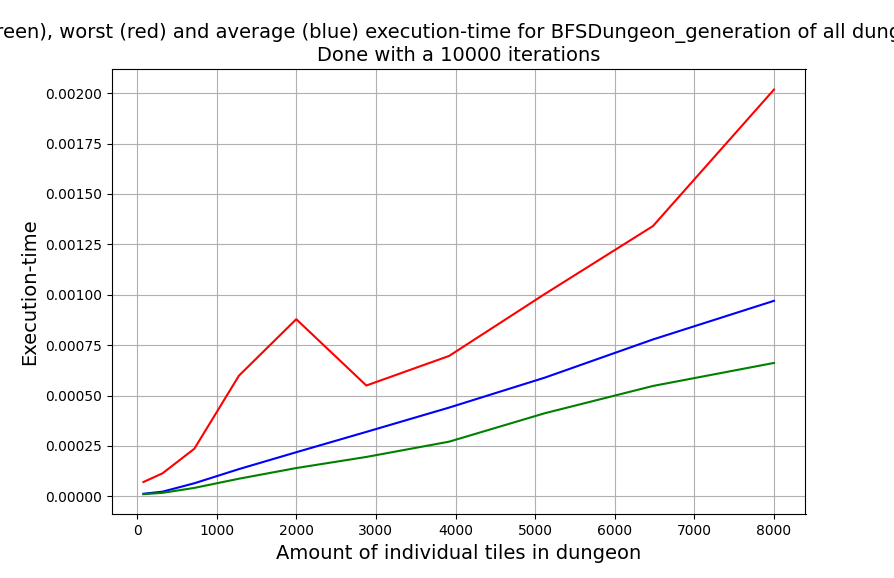
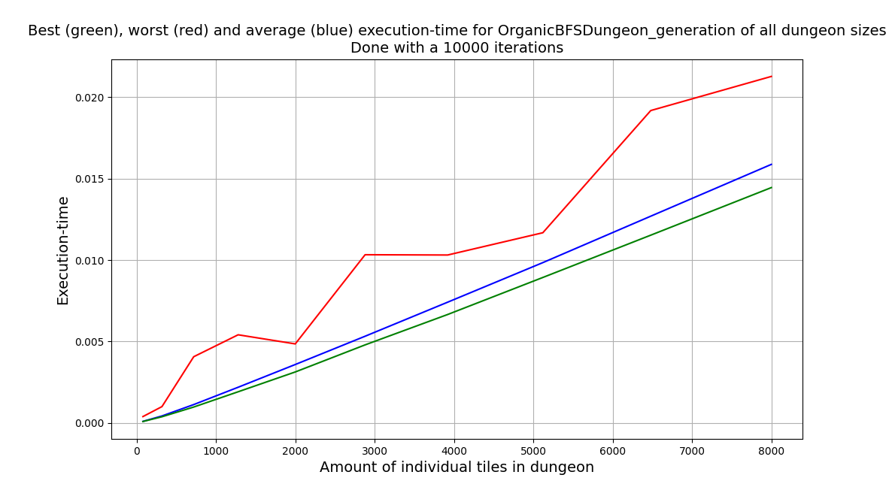

# Testing documentation

This document holds information about the testing aspect of the program. It is divided into two main parts; normal testing and performance testing. Normal testing concerns the core functuality of the program while performance testing concerns how well the code performs time-wise at different scales of the program.

## Normal testing

The normal tests covers all the core-functionality of the program. At this point these tests cover the chamber class, the node class and partly the BSPDungeon class.

## Performance testing

The performance tests cover the part of the program which is responsible for generating the actual dungeon. In other words the performance of ui_service and draw_dungeon are excemt of performance testing.

The performance tests I have written tests how quickly the BSPDungeon and OrganicBSPDungeon can generate a dungeon at different sizes, where the size is the number of individual squares in the dungeon. At each size the tests repeat 10 000 times and produces a worst, best and average time at every size. 

### BSPDungeon performance test

### OrganicBSPDungeon perfomance test

According to these tests there is quite a lot of jump for the worst case scenario. This can however be influenced by other aspects not indegious to the program itself. The larger trend is that the results follow a linear increase in time as the size increases. The average and best performances also indicate this. 

