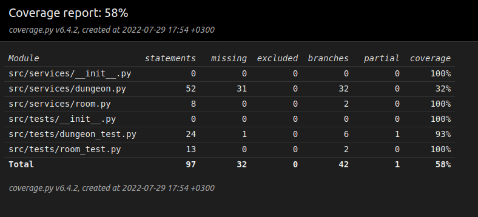

# Week 2 report

This week I started to code my actual program. Before I could do this I decided to install some dependencies and so forth as to make it easy to work with in the future. I used the instructions from the OHTE course as guide and I now have poetry and unitest in use. There is also a set of invokes which can be used to generate coverage reports and to start the program.

 Back to the actual program; I got it working to a degree, but there's still lots to be fixed. Also after all I did this week I thought of much better and more interesting ways to achieve results. I didn't however have the time this week to redo anything. I left two versions of the current program as I am not totally clear on which route I will go down.

What I have done in specific this week is to lay out the programs structure and to build the classes at a rough scale. Currently my program uses one class "Room" to hold information on specific rooms in the dungeon and then a second class Dungeon to piece everything together. Finally the dungeon can also be visualised through the function "draw dungeon". 

Some problems I ran into: I wouldn't want any of the individual rooms to overlap and to me it seems the method "check_for_overlap" in the Dungeon class should handle this, but I still get rooms overlapping I think - if the problem is not in the visualising part of the program. I haven't either finilised the "connect_rooms" as this is currently more or less a copy paste from another program (H.J. Petty, 2021). I used this project for inspiration, but I have already changed much of the specifics and I have started thinking of a better way to do this all together.

At its current state my program uses a raster format for storing information about rooms/walls in the dungeon. I'm thinking this is not optimal and will maybe run into performance issues at larger scales. I was thinking about turning it into a vector-based strucure instead. This would be much lighter since it only stores information about the rooms (and the corridors), and not information specificly for each raster/pixel. I was thinking I could then use the midpoint of each room as a node in a minimum spanning tree. I could for example use either Prim's or Kruskal's algorithm to find a minimum spanning tree for the nodes. To get the corridors to not go diagonally (I want them to go only horisontally and vertically), I would create the coridors alog the catheti of the right triangle formed from the two nodes and their hypothenuse. That is if it's not already vertical or horisontal. I'll have to see how I will make this. I'd also like to discuss this whole project with you as I am uncertain on an apropriate scale for the project.  

I also started writing tests for the program and came quite far. I didn't however finish it since I started to think about altertanive ways to do the project. 

# Coverage-report for Week 2

