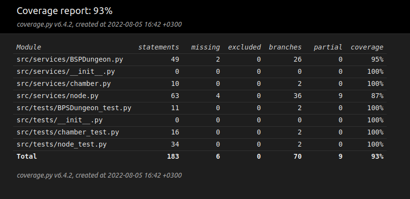

# Week 3

This week I pretty much started my project from srcatch after talking with the course instructor who told me that I should reconsider what algorithms I was using. I decided to stick to my subject of a dungeon generator, but I am now using different techniques to achieve the results. I am doing the generator so that I am using a BSP algorithm for room placement and then one can choose a method of connecting the rooms. Currently I have implemented two versions where the first version produces straight corridors between the rooms and the second version uses a different algorithm called the drunkard's walk to produce less straight corridors with a more organic look. I have also written tests for most of the classes.

I have found it hard to find a proper balance for the project. In the OHTE course I made the mistake of planning a project which was too ambitious and which meant I didn't have the time to do it as well as I'd like to. This was the reason I thought I'd do something much more basic this time around, but then again I chose something that was too basic. I hope that what I have done now is at a proper level - not too basic, but not too ambitous either. The idea is still to make something simple that is easily built upon to achieve more complex results.  

Since I had to start over I used quite a lot of time researching what I would do and how I would go about implementing BSP and Drunkard's Walk algorithm. Time spent: ca 18 hours.

## Week 3 Test coverage-report
 
